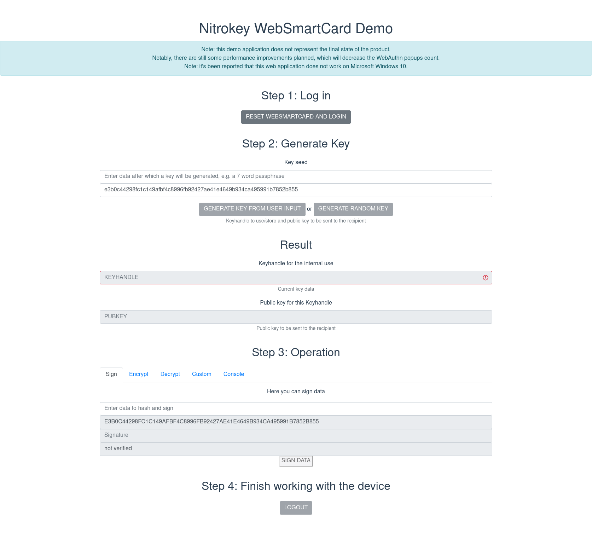
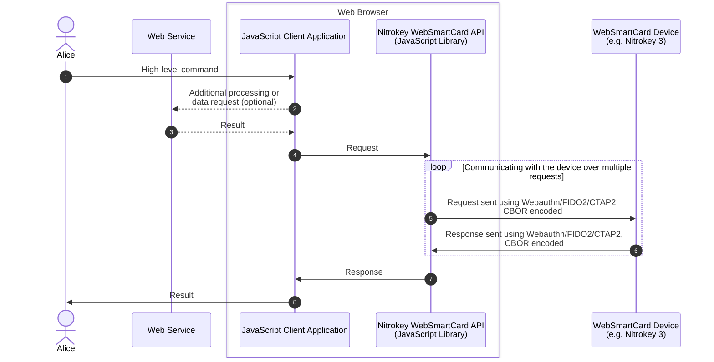
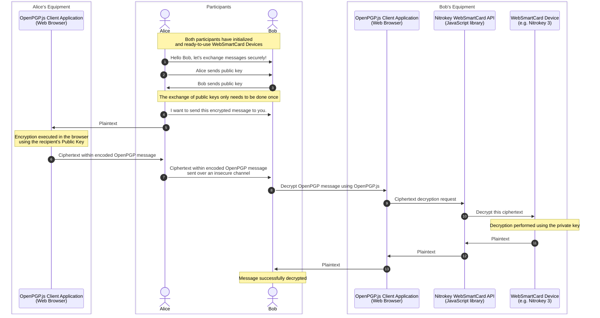

# Nitrokey WebSmartCard

### Smart Cards for the Web!

<!-- Demo app image placeholder -->

## Summary

The Nitrokey is an open-source hardware USB key that provides data encryption and two-factor authentication capabilities
using FIDO standards. While FIDO is supported by web browsers, utilizing the Nitrokey as a secure key store for email
and data encryption has traditionally required native software. As a result, email encryption within webmail using the
Nitrokey has not been possible until now.

Similarly, achieving strong end-to-end encryption in web applications has faced a common challenge: securely and
conveniently storing users' private keys. This typically requires native software, such as an instant messenger app, or
less secure methods, such as storing password-encrypted user keys on servers. To address these issues, Nitrokey aims to
enable the use of Nitrokey with web applications.

WebAuthn is a modern web authentication method that replaces passwords with public key cryptography. It uses FIDO (CTAP)
protocol to communicate with user's security devices. It allows websites to use strong security features built into
devices like Nitrokey 3.
By creating a private-public keypair (credential) for each website, where the private key is securely stored on the
user's device and the public key is sent to the server, WebAuthn enables servers to verify users' identities without
handling any secrets, making it significantly more secure and less susceptible to hacking attempts

The Nitrokey WebSmartCard project utilizes the FIDO (CTAP) protocol, shared by WebAuthn, to eliminate the need for device
drivers, browser add-ons, or separate software. This integration allows the solution to seamlessly function with any
modern browser supporting WebAuthn on various operating systems, including Android, and across different communication
channels like Bluetooth, NFC, and USB.

As a result, web applications gain the capability to locally store users' private keys on a Nitrokey, ensuring users
retain full control over their keys.

Note: Nitrokey WebSmartCard was formerly known as Nitrokey WebCrypt.

A demo application is available under:
- https://webcrypt.nitrokey.com

It can be used with any Nitrokey 3 device, which uses a "test" firmware, e.g. [v1.5.0-test.20230704](https://github.com/Nitrokey/nitrokey-3-firmware/releases/tag/v1.5.0-test.20230704).

## Terminology

To ensure clarity and shared understanding, the following key terms are used throughout this documentation:

1. **Device**: Refers to a WebSmartCard-compliant device that is typically in the possession of a user and connected via
   USB, NFC, or Bluetooth.
2. **Web application**: A JavaScript-based application running in a web browser and capable of communicating with
   servers over the internet.
3. **Client software**: Any software that directly communicates with the WebSmartCard-compliant device, either directly or
   through a web browser.
4. **Browser**: One of the platforms on which the client software runs.
5. **Main key**: The primary secret key stored on the device, which can be represented by a Word Seed for backup
   purposes.
6. **Resident key**: While distinct from FIDO's resident keys (aka Discoverable Keys), the concept is similar.
   WebSmartCard's Resident Keys are stored on the device and can be created through importation or generation.
7. **Derived key**: Although different from FIDO's derived keys, the concept is similar. Derived keys are generated from
   the main secret key, along with service metadata such as the RPID (including the domain name) or the user's
   additional passphrase.
8. **Seed** or **Word Seed**: A phrase consisting of 24-30 words from a known, limited word count dictionary, enabling the restoration of
   the main key on any device.
9. **PIN**: A password or passphrase with a limited number of attempts, used to unlock the device and execute WebSmartCard
   operations.
10. **Backup**: A data structure that facilitates the restoration of the device's state on the same or a different
    instance.
11. **KDF**: Short for Key Derivation Function, it refers to a cryptographic hash function that derives a secret key
    from an input, such as a passphrase, using a pseudorandom function.

Please refer to these defined terms throughout the documentation to ensure a consistent understanding of their meanings.

# Solution

## Implementation Details

The implementation of Nitrokey WebSmartCard incorporates the following design considerations:

1. **Inspiration from OnlyKey's WebCrypt**: The solution draws inspiration from OnlyKey's WebCrypt proof-of-concept,
   leveraging its concepts and ideas.

2. **CTAP2 (FIDO2) Compliance**: To ensure future-proofness and compatibility, Nitrokey WebSmartCard utilizes CTAP2 (FIDO2)
   and newer specifications. This choice mitigates potential incompatibilities in the long run. Additionally, for
   backward compatibility (optional), CTAP1 (FIDO U2F) may be included.

3. **Focus on ECC Algorithms**: To simplify usage and enhance usability, Nitrokey WebSmartCard primarily focuses on elliptic
   curve cryptography (ECC) algorithms. The support for RSA is provided as an optional feature, specifically for key
   importing and utilization of existing keys.

4. **OpenPGP Card Interface**: The OpenPGP Card interface is integrated to facilitate the implementation of OpenPGP.js 
   with the support of a hardware Secure Element, ensuring secure operations for this JavaScript library.

5. **Support for USB, NFC, and Web Browsers**: Nitrokey WebSmartCard is designed to seamlessly work with WebSmartCard-compliant
   devices via USB and NFC connections. Furthermore, it offers compatibility with standard web browsers, enabling broad
   accessibility and usage across different platforms.

By adhering to these implementation details, Nitrokey WebSmartCard aims to provide a robust, secure, and user-friendly
experience for developers leveraging its functionalities. Please refer to the [implementation](./implementation.md)
sections for more detailed information.

### Communication Channel

The following sequence diagram illustrates the process of a high-level command exchange between Alice and a JavaScript Client
Application (with an optional communication to the Web Service, which Alice visits), which communicates with the Nitrokey WebSmartCard API and the WebSmartCard Device (e.g. Nitrokey 3). The
communication involves multiple requests and responses using Webauthn/FIDO2/CTAP2 and encoded in CBOR. Ultimately, the
result of the command is sent back to Alice.

### Example Use Case

#### OpenPGP Encrypted Email Exchange

The sequence diagram outlines the secure message exchange process between Alice and Bob using OpenPGP.js Client
Applications, WebSmartCard API, and WebSmartCard Devices (e.g. Nitrokey 3). Both participants have initialized and
ready-to-use WebSmartCard Devices. The exchange involves:

1. **Initialization**: Alice and Bob exchange their public keys once for secure communication.

2. **Message Exchange**: Alice sends an encrypted message to Bob using Bob's public key. The encryption occurs in the
   browser using the recipient's public key. Bob receives the ciphertext over an insecure channel.

3. **Decryption**: Bob decrypts the message using OpenPGP.js. The unpacked ciphertext is sent to the WebSmartCard Device
   for decryption using the private key. Finally, Bob successfully decrypts and reads the plaintext message.

## User Keys

The user keys feature of this solution provides support for multiple keys, which can be derived dynamically from a main
key or imported and securely stored as resident keys on the device. All key operations, such as signing and decryption,
require the corresponding public key to be provided as a parameter. The key operations follow the following scheme:

1) First, the system checks if a public key or key handle matches any stored (resident) key and origin. If there is no
   match, the process continues with step 2. If there is a match, the process proceeds to step 3.

2) In step 2, the key is derived using the key derivation function (KDF) with the main key, key handle, and origin as
   inputs. The derived key is then verified for validity against the HMAC.

3) Once the key is found, the key operation is computed using the payload.

4) Finally, the result of the key operation is returned.

Additional information:

- Each key's attributes include a usage flag indicating whether it is meant for encryption/decryption, signing, or both.
- The main key used in the derivation process is 256 bits in length.

Note: The derivation algorithm is currently a work in progress and subject to ongoing development and refinement.

#### Cross and Same Origin Keys

Nitrokey WebSmartCard supports the configuration of keys for cross-origin or same-origin usage, allowing flexibility while
addressing potential privacy risks. Use cases that involve sharing keys across different origins, such as email
encryption, can choose to disable this option for their specific keys.

For same-origin **resident** keys, the associated origin is securely stored along with the secret key on the device. When
accessing a same-origin key, the device verifies the origin to ensure its validity.

For same-origin **derived** keys, the origin is provided as input to the Key Derivation Function (KDF).
As a result, same-origin and cross-origin scenarios yield distinct keys.

When invoking a key operation, the web application specifies, via a parameter, whether a same-origin or cross-origin key
should be utilized. The browser, rather than the web application, provides the actual origin information, ensuring
accurate and secure origin determination.

Additionally, cross-origin keys can be configured with an allowed domain list to ensure their scope is limited to specific services, providing enhanced user privacy protection.

#### User Authentication and PIN Mechanism

The PIN serves as a crucial authentication factor for users when authorizing key operations within Nitrokey WebSmartCard. It
can be configured to operate in either of the following modes:

1. **PIN Required for Every Operation**: In this mode, the PIN is required for authentication before every key
   operation. This ensures heightened security but may involve repeated PIN entry for consecutive operations.

2. **PIN Required Once per Device Session**: Alternatively, the PIN can be configured to be required only once per
   device session. This option reduces the frequency of PIN entry during consecutive operations while maintaining the
   necessary level of security. The PIN has to be entered for each Origin separately.

3. **PIN Required After a Timeout**: Timed-out PIN requirement for enhanced security. Once the PIN is initially entered
   and
   authenticated, the device will accept all commands originating from the authenticated origin for a specified period
   of time. This period is determined by a timeout mechanism, which can be set as a constant value or calculated based
   on the duration since the last action. This approach strikes a balance between user convenience and security,
   minimizing the need for repetitive PIN entry while maintaining the necessary level of protection. This employs a
   similar approach to the one adopted in online banking access, where an auto-logout takes place after a specified
   period of inactivity.

In either case, every sign and decrypt operation requires touch confirmation, typically in the form of a button press,
to authorize the operation. This additional step ensures explicit user consent for sensitive operations.

To ensure both interoperability and enhanced security, Nitrokey WebSmartCard utilizes WebAuthn's PIN mechanism. This choice
provides the advantage of improved compatibility across different platforms and, importantly, prevents the exposure of
the PIN to JavaScript, thereby bolstering security.

For backward compatibility and to accommodate FIDO U2F handling, there may be an option to unlock a device with a PIN
passed through the JavaScript application. However, it's important to note that this configuration option is designed to
be user-controlled.
However, due to the widespread adoption of FIDO2, we are considering removing support for FIDO U2F and its associated
commands. As FIDO2 gains popularity, it has become the preferred standard for secure authentication. This shift allows
us to streamline our implementation and focus solely on supporting FIDO2 functionalities. By aligning with the
prevailing industry standard, we can ensure better compatibility and improved user experience for our users.

#### Seed and Key Generation

During device initialization, Nitrokey WebSmartCard establishes a seed (sourced randomly, or generated from the user-provided 24+ word seed), which serves as the foundation for deriving a main
key and an encryption key. The main key is utilized to derive various keys, whereas encryption key functions as a
source for encrypting resident keys.

The seed holds significant importance as it enables the regeneration of all device-generated keys (except for the
Resident Keys). By providing the seed, users can restore the entire derived keys hierarchy, effectively serving as a
backup mechanism. It is important to note that this restoration capability applies exclusively to derived keys. Keys
that are imported by the user, or generated to be stored on device (Resident Keys) are not restored through the seed;
instead, it is assumed that a backup of such keys already exists.

For generating ECC keys from a passphrase/seed and storing them in an OpenPGP format, you can refer to the Proof of
Concept (POC) available [here](https://github.com/skeeto/passphrase2pgp). This POC demonstrates the process of
generating ECC keys and their storage in an OpenPGP-compatible format.

## Commands

This solution supports the following commands:

1) **Initialize or Restore from Seed**: This command allows for the initialization of the system or the restoration of
   its state from a seed.

2) **Generate Non-Resident Key**: With this command, you can generate a non-resident key dynamically.

3) **Write Resident Key**: This command is used to write resident keys to the device. It is primarily intended for
   externally existing keys.

4) **Read Public Key**: This command enables the retrieval of the public key associated with resident and derived keys.

5) **Sign**: The sign command allows for the signing of data. It requires parameters such as the data hash to be signed,
   the key handle, HMAC, and origin.

6) **Decrypt**: This command is used for decrypting data. It takes parameters such as the data to be decrypted, the key
   handle, HMAC, and origin.

7) **Status**: The status command provides information about the system, including whether it is unlocked, the version,
   and the number of available resident key slots.

8) **Configure**: This command is used to configure various settings related to the solution. Detailed configuration
   options can be found above.

Optional commands for FIDO U2F compatibility (when FIDO2 method is not available; may be removed in the future):

9) **Unlock**: This command is provided for compatibility with FIDO U2F. It allows for unlocking the system when
   necessary.

10) **Reset**: This command is provided for compatibility with FIDO U2F. It allows for resetting the system when
    required.

### OpenPGP-like Commands

In addition to the previously mentioned commands, this solution also provides a separate set of commands specifically
designed for OpenPGP-like support, particularly for the OpenPGP.js case. These commands enable compatibility and
integration with OpenPGP.js functionality. The specific commands available for OpenPGP-like support include:

1) **OpenPGP Initialize or Restore**: This command initializes the system or restores its state specifically for OpenPGP
   support using OpenPGP.js.

2) **OpenPGP Encrypt**: With this command, you can encrypt data using OpenPGP encryption standards. (planned)

3) **OpenPGP Decrypt**: This command allows for the decryption of OpenPGP encrypted data.

4) **OpenPGP Sign**: Use this command to sign data using OpenPGP signing mechanisms.

5) **OpenPGP Verify**: This command verifies the signature of OpenPGP signed data.

6) **OpenPGP Key Management**: This set of commands facilitates key management operations specific to OpenPGP, such as
   generating OpenPGP keys, importing and exporting keys, and managing key attributes.

These OpenPGP-like commands are tailored to support seamless integration with OpenPGP.js and enable the utilization of
OpenPGP encryption and signing capabilities.

## Use Cases

With Nitrokey WebSmartCard, users can securely store all their web-related secrets on a compliant device, such as Nitrokey 3. Whether it's communication, passwords for FIDO-less web pages, or encrypted data storage, Nitrokey WebSmartCard has got you covered. Below is the comprehensive list of use-cases:

1. **User-to-User Communication**
    - **Email**: Nitrokey WebSmartCard supports encrypted and authenticated email, following a scheme similar to the OpenPGP smart
      card scheme.
    - **Chats**: Users can establish secure communication channels using keys per recipient, per channel, or per
      day/session. This functionality is comparable to popular secure messaging applications such as Signal and Element.
    - **Sharing Encrypted Files or Text**: Nitrokey WebSmartCard enables secure sharing of encrypted files or text, similar to
      encrypted pastebin services and Firefox Send.

2. **User Data Ownership**
    - Nitrokey WebSmartCard facilitates the operation of platforms that prioritize user data ownership. Instead of storing data on
      their own servers, platforms using this library store the data on the user's device. This allows for seamless data
      transfer to other services and simplifies the process of migrating an account between servers. By executing
      processing tasks on the user's device, such as a USB security key and JavaScript application, the service operator
      removes the responsibility of storing user data and mitigates the legal consequences of cross-border data
      transfers.

3. **Authentication**
    - Nitrokey WebSmartCard provides authentication capabilities similar to FIDO2, allowing users to establish secure and reliable
      authentication mechanisms.

4. **Secure Payments**
    - Users can leverage Nitrokey WebSmartCard to facilitate secure payment transactions, ensuring the confidentiality and
      integrity of sensitive financial information.

5. **Password Replacement**
    - Nitrokey WebSmartCard offers a password replacement mechanism by utilizing derived Public Keys and a single passphrase,
      which can serve as a backup seed phrase. This approach enhances security by reducing reliance on traditional
      passwords and simplifying the authentication process.

6. **Encrypted Internet**
    - With Nitrokey WebSmartCard, users can access encrypted web pages that are decrypted exclusively on their own devices
      through a JavaScript application. This ensures that the data remains encrypted throughout the transmission and is
      decrypted only on the user's host.

7. **Use of Insecure or Third-Party Platforms for Data Storage**
    - Nitrokey WebSmartCard empowers users to utilize insecure or third-party platforms for sending and storing data, including
      backups. By encrypting the data using Nitrokey WebSmartCard's functionality, users can maintain the security and privacy of
      their information, even when using platforms that may not provide inherent security measures.

8. **Sending Encrypted Messages through Any Channel using Webextension or Android Application**
    - Nitrokey WebSmartCard empowers users to establish their own secure end-to-end encrypted channels for sending messages
      through any channel using a Webextension or Android application.

9. **Hierarchical Deterministic Password Manager**

    - Nitrokey WebSmartCard includes a feature for a Hierarchical Deterministic Password Manager. This password management
      functionality generates passwords deterministically based on a main secret, domain name, and optionally, a login
      (for multiple accounts per service). By leveraging this capability, users can consolidate all their passwords on a
      single device and regenerate them just using the main secret.

      Additional features of the Hierarchical Deterministic Password Manager include:

        - **User-Chosen Number or Passphrase**: Users can provide a user-chosen number or passphrase to generate
          subsequent passphrases. This feature is particularly useful for complying with third-party services that
          require frequent password changes.

        - **Additional Passphrase for Enhanced Protection**: Users have the option to use an additional passphrase for
          extra protection. If an adversary attempts to force the passphrase from the user, not providing this
          additional passphrase will generate a different password, thereby safeguarding against unauthorized access.

Please refer to the [implementation](./implementation.md) sections for detailed information on how to implement these use cases using Nitrokey
WebSmartCard.

## Questions & Answers

#### Advantages of Derived Keys

The use of derived keys, as the default approach over resident keys, offers several significant advantages:

1. **Backup Mechanism**: For encryption use cases, such as those enabled by WebSmartCard, a backup mechanism is essential.
   To ensure ease of use, we provide a user-friendly backup mechanism. A seed phrase or backup phrase serves as a
   straightforward and accessible solution. From a technical perspective, a backup seed necessitates derived keys in ECC
   format, as opposed to RSA. Compared to traditional file backups, a seed-based backup offers the following advantages:
    * No separate storage or passphrase protection is required for a backup file.
    * Generating a new key does not necessitate creating and managing a new backup file repeatedly.
    * User experience is improved, as relying on backups alone often results in inadequate execution, potentially
      leading to frustration and data inaccessibility.

2. **Privacy Considerations**: The use of a single or a few resident keys could potentially enable malicious websites to
   track users' devices, compromising their privacy. By defaulting to derived keys, we mitigate this risk and prioritize
   user privacy.

3. **Expanded Key Usage**: With resident keys, there is a limitation on the number of keys that can be stored, imposing
   constraints on key storage. In contrast, derived keys allow for an unlimited number of keys, enabling more extensive
   usage scenarios and offering greater flexibility.

By adopting derived keys as the default approach, Nitrokey WebSmartCard ensures a user-friendly backup mechanism, enhances
privacy protection, and enables a wider range of key usage possibilities.
